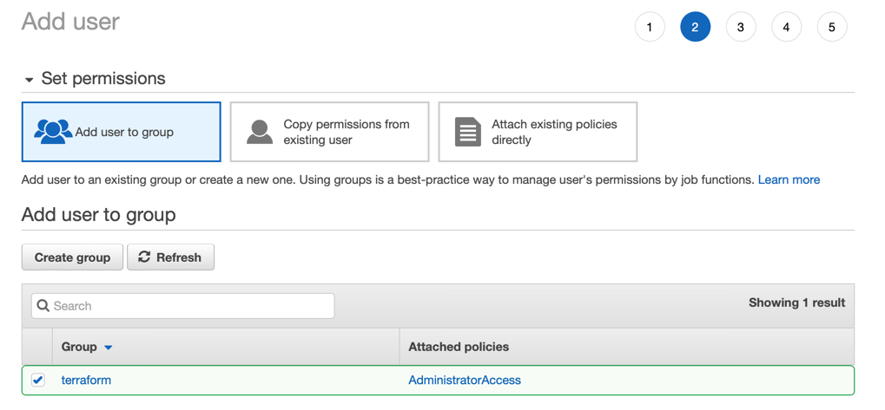
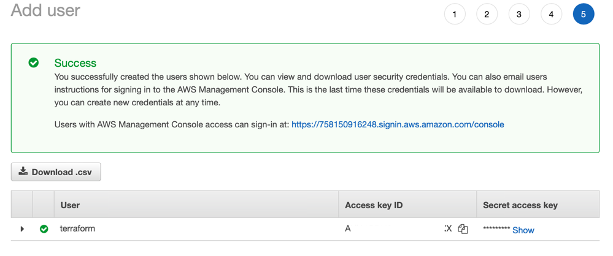
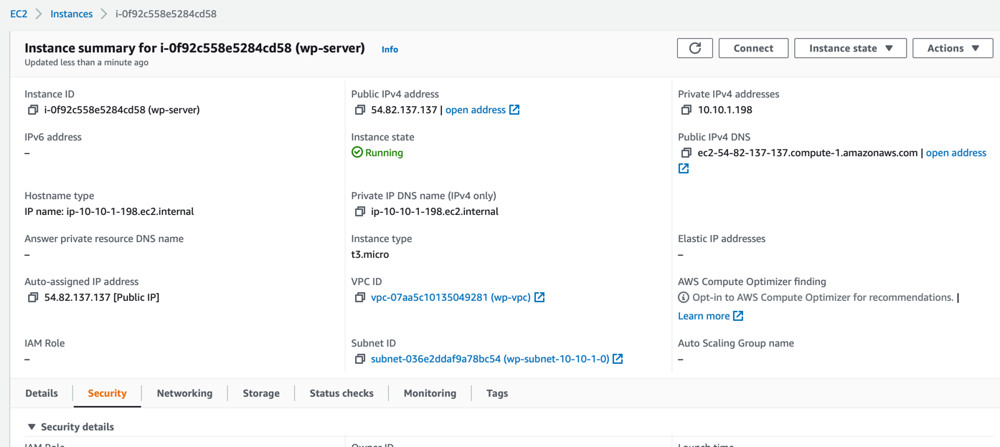

# Розгортання додатку на AWS

Створено користувача для terraform

Створено файл з налаштуваннями для terraform (main.tf)

Для того, щоб ключі використано змінні оточення
export AWS_ACCESS_KEY_ID=key
export AWS_SECRET_ACCESS_KEY=secret

Командами `terraform init` та `terraform apply` створено інстенс

На інстансі було запущено wordpress із докер контейнера.
